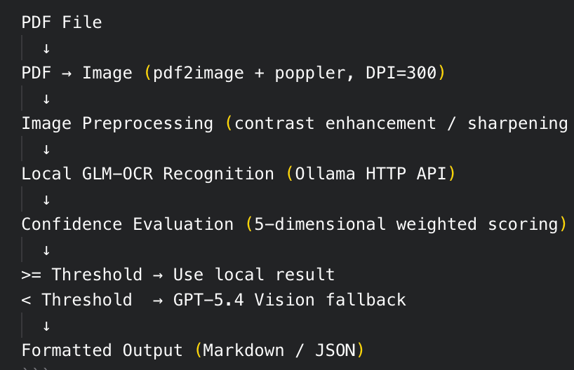

# pdf-ocr

PDF 文档 OCR 识别工具，支持扫描件、盖章遮挡、模糊文字等场景。

采用混合架构：本地 GLM-OCR（Ollama）优先识别，低置信度时自动回退到 GPT-5.4 Vision，输出 Markdown 或 JSON。

## 架构流程



```
PDF 文件
  ↓
PDF → 图片 (pdf2image + poppler, DPI=300)
  ↓
图像预处理 (对比度增强 / 锐化 / 可选红章掩膜)
  ↓
GLM-OCR 本地识别 (Ollama HTTP API)
  ↓
置信度评估 (5维加权评分)
  ↓
>= 阈值 → 使用本地结果
< 阈值  → GPT-5.4 Vision 兜底
  ↓
格式化输出 (Markdown / JSON)
```

## 环境要求

- macOS / Linux
- Python 3.10+
- [poppler](https://poppler.freedesktop.org/) — PDF 转图片
- [Ollama](https://ollama.ai) — 本地运行 GLM-OCR 模型
- `OPENAI_API_KEY` 环境变量（LLM 兜底需要，纯本地模式可不设）

## 快速开始

### 1. 安装依赖

```bash
cd pdf-ocr
bash scripts/setup_env.sh
```

此脚本会：
- 检查 `poppler` 和 `ollama` 是否已安装
- 创建 Python venv 并安装依赖
- 拉取 `glm-ocr` 模型到 Ollama

### 2. 启动 Ollama 服务

```bash
ollama serve
```

### 3. 运行 OCR

```bash
# 通过 start.sh（推荐，自动激活 venv）
./start.sh your_document.pdf

# 或手动激活 venv 后直接调用
source .venv/bin/activate
python scripts/ocr_pipeline.py your_document.pdf
```

## 使用示例

```bash
# 基本用法 — 输出 Markdown 到终端
./start.sh contract.pdf

# JSON 格式输出到文件
./start.sh contract.pdf --format json --output result.json

# 启用红章掩膜（盖章遮挡场景）
./start.sh contract.pdf --stamp-mask

# 高 DPI 处理模糊文档
./start.sh contract.pdf --dpi 400 --stamp-mask

# 纯本地模式（不调用 OpenAI API）
./start.sh contract.pdf --force-local

# 组合使用
./start.sh invoice.pdf --format json --stamp-mask --dpi 400 --output invoice.json
```

## CLI 参数

| 参数 | 默认值 | 说明 |
|------|--------|------|
| `<pdf_path>` | (必填) | PDF 文件路径 |
| `--format` | `markdown` | 输出格式：`markdown` 或 `json` |
| `--output` | stdout | 输出文件路径 |
| `--threshold` | `0.6` | 置信度阈值，低于此值触发 LLM 兜底 |
| `--dpi` | `300` | PDF 转图片分辨率，模糊文档建议 400 |
| `--force-local` | off | 禁用 LLM 兜底，仅使用本地 OCR |
| `--max-fallback-pages` | `10` | 最多允许多少页调用 LLM（控制成本） |
| `--no-enhance` | off | 禁用图像增强预处理 |
| `--stamp-mask` | off | 启用红章掩膜淡化处理 |

## 输出格式

### Markdown

保留文档原始结构（标题、表格、段落），多页用 `---` 分隔。

### JSON

包含完整元数据：

```json
{
  "source_file": "contract.pdf",
  "total_pages": 1,
  "output_format": "json",
  "pages": [
    {
      "page_number": 1,
      "content_markdown": "# 采购合同 ...",
      "confidence": 0.82,
      "engine": "glm-ocr",
      "fallback_reasons": []
    }
  ],
  "processing_time_seconds": 5.67
}
```

详细 Schema 见 [references/output_schema.md](references/output_schema.md)。

## 置信度评估

| 维度 | 权重 | 低分触发条件 |
|------|------|-------------|
| 文本长度 | 0.30 | < 50 字符 |
| 乱码比例 | 0.25 | 非 CJK/ASCII > 20% |
| 文本密度 | 0.20 | 字符数/图片面积过低 |
| 结构完整度 | 0.15 | 无 Markdown 标记 |
| 语言一致性 | 0.10 | 无可识别语言字符 |

## 项目结构

```
pdf-ocr/
├── SKILL.md                 # Verdent/OpenCode Skill 元数据
├── README.md                # 英文文档
├── README_CN.md             # 本文档（中文版）
├── mcp_server.py            # MCP Server（Verdent/OpenCode/OpenClaw 通用）
├── start.sh                 # 一键启动脚本（CLI 模式）
├── scripts/
│   ├── requirements.txt     # Python 依赖（含 MCP SDK）
│   ├── setup_env.sh         # 环境初始化
│   ├── ocr_pipeline.py      # 主入口 CLI
│   ├── pdf_to_images.py     # PDF → PNG
│   ├── preprocess.py        # 图像增强 + 红章掩膜
│   ├── local_ocr.py         # GLM-OCR (Ollama API)
│   ├── confidence.py        # 置信度评估
│   ├── llm_fallback.py      # GPT-5.4 Vision 兜底
│   └── output_formatter.py  # Markdown/JSON 格式化
└── references/
    └── output_schema.md     # JSON 输出 Schema
```

## 作为 Verdent Skill 使用

将 `pdf-ocr/` 目录复制到 `~/.verdent/skills/pdf-ocr/` 即可被 Verdent 自动识别和调用。

## 作为 MCP Server 使用（推荐）

MCP Server 模式兼容 **Verdent、OpenCode、OpenClaw** 及所有支持 MCP 协议的客户端。

### 暴露的工具

| 工具名 | 功能 | 主要参数 |
|--------|------|---------|
| `ocr_pdf` | 完整 OCR 管线 | `pdf_path`, `output_format`, `threshold`, `dpi`, `force_local`, `stamp_mask` |
| `ocr_pdf_check` | 快速检查 PDF 信息 | `pdf_path` |

### 配置方式

将以下内容添加到客户端的 MCP 配置文件中：

**Verdent** (`~/.verdent/mcp.json`)：
```json
{
  "mcpServers": {
    "pdf-ocr": {
      "command": "/path/to/pdf-ocr/.venv/bin/python",
      "args": ["/path/to/pdf-ocr/mcp_server.py"],
      "env": {
        "OPENAI_API_KEY": "your-key-here"
      }
    }
  }
}
```

**OpenCode** (`~/.config/opencode/config.json` 或项目 `.opencode/config.json`)：
```json
{
  "mcpServers": {
    "pdf-ocr": {
      "command": "/path/to/pdf-ocr/.venv/bin/python",
      "args": ["/path/to/pdf-ocr/mcp_server.py"],
      "env": {
        "OPENAI_API_KEY": "your-key-here"
      }
    }
  }
}
```

**OpenClaw** (`~/.openclaw/mcp.json` 或项目配置)：
```json
{
  "mcpServers": {
    "pdf-ocr": {
      "command": "/path/to/pdf-ocr/.venv/bin/python",
      "args": ["/path/to/pdf-ocr/mcp_server.py"],
      "env": {
        "OPENAI_API_KEY": "your-key-here"
      }
    }
  }
}
```

> 将 `/path/to/pdf-ocr` 替换为实际的 `pdf-ocr/` 目录绝对路径。
> 纯本地模式下 `OPENAI_API_KEY` 可省略（工具参数中设置 `force_local=true`）。

### 手动测试 MCP Server

```bash
# 启动 MCP 开发检查器
cd pdf-ocr
source .venv/bin/activate
mcp dev mcp_server.py
```

## 许可证

核心依赖均为 Apache-2.0 / MIT 许可，无 GPL 分发风险。
